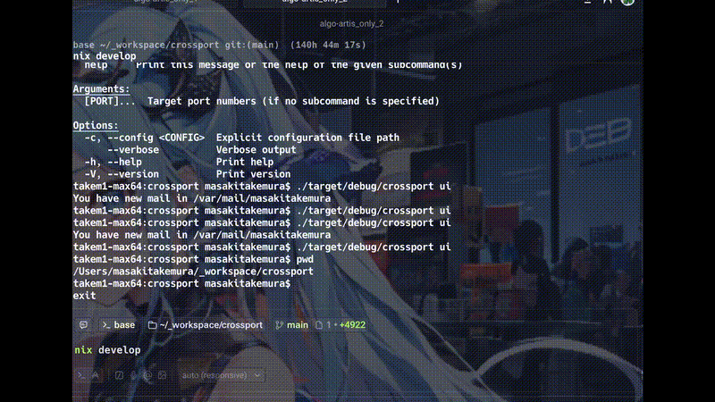

# Crossport

**Stop guessing "What's using port 8080?".** Crossport visualizes your local development ports with full context (Git/Docker/K8s) and lets you manage them safely.

[](https://github.com/mt4110/crossport/actions)
[](./LICENSE)
<p align="center">
  
</p>

[🇯🇵 日本語](./README_ja.md)

## Why Crossport?

Unlike generic process killers, `crossport` is built specifically for developers:

- **Project Awareness** – See which project is using each port, not just `node` or `python`
- **Docker Integration** – Automatically resolves container names for Docker processes  
- **Interactive TUI** – Real-time process manager with keyboard navigation (`crossport ui`)
- **Gentle Kill Strategy** – Tries `SIGINT` → `SIGTERM` → `SIGKILL` for graceful shutdown
- **Smart Port Finder** – Find free ports and auto-update your `.env` files
- **Unix Pipeline Friendly** – JSON output for scripting (`crossport scan --json | jq ...`)

## Installation

### From GitHub Releases (Recommended)

Download the latest binary for your OS from the [Releases](https://github.com/mt4110/crossport/releases) page.

### From Source

```bash
git clone https://github.com/mt4110/crossport.git
cd crossport
cargo install --path .
```

### Using Nix

```bash
nix develop
# 💡 Inside the shell, you can use these shortcuts:
#   cx     -> cargo run --
#   build  -> cargo build --release
#   test   -> cargo test
```

Or install it globally (like `go install`):

```bash
nix profile install .
crossport --version
```

## Quick Start

### Interactive Mode (TUI)

The recommended way to use Crossport:

```bash
crossport ui
```

**Controls:**
- `j` / `k` or ↑/↓ – Navigate
- `x` – Kill selected process (with confirmation)
- `q` – Quit

### Command Line

#### Scan Ports

```bash
# Scan default range (3000-9999)
crossport scan

# Scan specific range
crossport scan --from 8000 --to 9000

# JSON output for scripting
crossport scan --json | jq '.[] | select(.kind == "Docker")'
```

**Output:**
```
PORT   PID      USER     CMD      KIND     PROJ
3000   39338    user     node     dev      my-frontend
5432   12456    user     postgres docker   my-db-container
8080   67890    user     python   other    backend-api
```

#### Kill Process

```bash
# Kill with interactive confirmation (default)
crossport kill 3000

# Force kill without confirmation
crossport kill 3000 --force

# See what would be killed (dry run)
crossport kill 3000 --dry-run
```

#### Suggest Free Port

```bash
# Find next available port starting from 3000
crossport suggest

# Auto-update .env file
crossport suggest --env .env.local --key PORT
```

## Configuration

Crossport looks for config files in this order:
1. CLI arguments (highest priority)
2. `./crossport.toml` (project-local)
3. `~/.config/crossport/config.toml` (user global)

**Example `crossport.toml`:**

```toml
[scan]
default_range = "3000-9000"

[kill]
confirm = true
default_signal = "SIGTERM"

[ui]
color = true
```

## Features

### Project Awareness

Crossport automatically detects the git root of each process and displays the **project name** instead of just the command name. This makes it easy to identify which app is using which port.

### Docker Integration

When a port is exposed by a Docker container, Crossport shows the **container name** in the `PROJ` column, making it easy to identify containerized services.

### JSON Export

Perfect for Unix pipelines and automation:

```bash
# Get all dev ports as JSON
crossport scan --json | jq '.[] | select(.kind == "dev") | .port'

# Check if port 3000 is in use
crossport 3000 --json | jq -e '.[0].pid > 0' && echo "Port in use"
```

### Gentle Kill

Instead of immediately sending `SIGKILL`, Crossport tries:
1. `SIGINT` (like pressing Ctrl+C) – allows cleanup handlers to run
2. `SIGTERM` (after 2s) – standard termination signal
3. `SIGKILL` (after 5s) – forced termination as last resort

This gives Node.js, Python, and other runtimes time to close database connections, flush buffers, and save state.

## Development

### Running Tests

```bash
cargo ctest
```

### Building

```bash
cargo build --release
./target/release/crossport --version
```

## Roadmap

- [x] TUI Mode (`crossport ui`)
- [x] Docker Integration
- [x] Configuration Files
- [x] JSON Output
- [x] CI/CD with GitHub Actions
- [x] **v0.3**: Detailed Inspector (Bind IP, internal ports, etc.)
- [x] **v0.3**: Windows support improvements
- [x] Watch Mode (`crossport scan --watch`)
- [x] Kubernetes pod detection
- [x] Kubernetes port-forward detection
- [ ] **v0.4**: Advanced TUI
  - [ ] Sort & Filter processes
  - [ ] Detailed Inspector View (Modal)
  - [ ] Kill History & Logs
  - [ ] Docker/K8s specific actions

## Contributing

Contributions are welcome! Please feel free to submit a Pull Request.


## Privacy & Security

**Crossport runs entirely on your local machine.**

- **No Data Collection**: It does not collect, store, or transmit any analytical data or code from your computer.
- **Local Operations**: All port scanning and process management happens locally using standard system APIs (`lsof`, `netstat`, Docker API).
- **Open Source**: The code is 100% open source. You can verify exactly what it does by reviewing the source code.

## License

MIT License. See [LICENSE](./LICENSE) for details.

## Acknowledgments

Built with Rust 🦀 and love for developer productivity.
