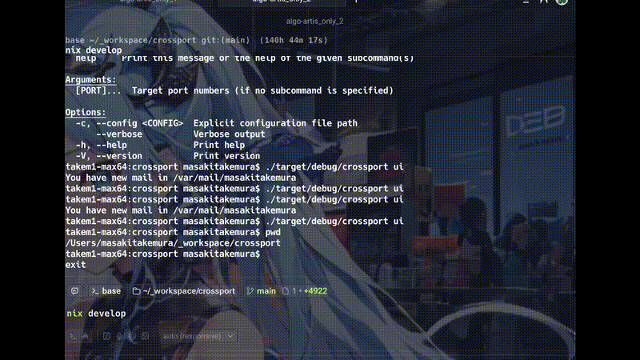

# Crossport

**「8080番、誰が使ってる？」をもう推測しない。** Git/Docker/K8sのコンテキスト付きでポートを可視化・管理できる次世代のポートプロセス管理ツール。

[🇺🇸 English](./README.md)

[](https://github.com/your-username/crossport/actions)
[](./LICENSE)

<p align="center">
  
</p>

## なぜ Crossport?

単なるプロセス終了ツールではなく、`crossport` は開発者のために作られました：

- **プロジェクト認識** – `node` や `python` だけでなく、どの**プロジェクト**がポートを使っているかを表示
- **Docker / K8s 統合** – コンテナ名やKubernetesサービスのターゲットを自動解決して表示
- **インタラクティブ TUI** – キーボードで操作できるリアルタイムプロセスマネージャー (`crossport ui`)
- **優しい終了戦略** – `SIGINT` → `SIGTERM` → `SIGKILL` の順に試行し、安全に終了
- **スマートポート検索** – 空きポートを探して `.env` ファイルを自動更新
- **Unixパイプライン** – スクリプト用にJSON出力が可能 (`crossport scan --json | jq ...`)

## インストール

### GitHub Releases (推奨)

[Releases](https://github.com/your-username/crossport/releases) ページからお使いのOS用のバイナリをダウンロードしてください。

### ソースからビルド

```bash
git clone https://github.com/your-username/crossport.git
cd crossport
cargo install --path .
```

### Nix を使用する場合

```bash
nix develop
# 💡 シェル内でのショートカット:
#   cx     -> cargo run --
#   build  -> cargo build --release
#   ctest  -> cargo test
```

または、グローバルにインストールする場合（`go install` のように）：

```bash
nix profile install .
crossport --version
```

## クイックスタート

### インタラクティブモード (TUI)

推奨される使用方法です：

```bash
crossport ui
```

**操作:**
- `j` / `k` または ↑/↓ – 移動
- `x` – 選択したプロセスを終了（確認あり）
- `q` – 終了

### コマンドライン

#### ポートスキャン

```bash
# デフォルト範囲をスキャン (3000-9999)
crossport scan

# 特定の範囲をスキャン
crossport scan --from 8000 --to 9000

# JSON出力（スクリプト用）
crossport scan --json | jq '.[] | select(.kind == "Docker")'
```

**出力例:**
```
PORT   PID      USER     CMD      KIND     PROJ
3000   39338    user     node     dev      my-frontend
5432   12456    user     postgres docker   my-db-container
8080   -        user     kubectl  k8s      svc/backend-api
```

#### プロセス終了

```bash
# 対話的な確認付きで終了（デフォルト）
crossport kill 3000

# 確認なしで強制終了
crossport kill 3000 --force

# 何が終了されるかを確認（ドライラン）
crossport kill 3000 --dry-run
```

#### 空きポート提案

```bash
# 3000番から順に空きポートを探す
crossport suggest

# .env ファイルを自動更新
crossport suggest --env .env.local --key PORT
```

## 設定

設定ファイルは以下の順序で読み込まれます：
1. CLI引数（最優先）
2. `./crossport.toml`（プロジェクトローカル）
3. `~/.config/crossport/config.toml`（ユーザーグローバル）

**`crossport.toml` の例:**

```toml
[scan]
default_range = "3000-9000"

[kill]
confirm = true
default_signal = "SIGTERM"

[ui]
color = true
```

## 機能

### プロジェクト認識

各プロセスの git ルートを自動検出し、コマンド名だけでなく **プロジェクト名** を表示します。これにより、どのアプリがどのポートを使用しているかが一目でわかります。

### Docker & Kubernetes 統合

Docker コンテナによってポートが公開されている場合、`PROJ` 列に **コンテナ名** を表示します。また、`kubectl port-forward` も検知し、ターゲットとなるサービス名を表示するため、コンテナ化されたサービスを容易に識別できます。

### JSON エクスポート

Unixパイプラインや自動化に最適です：

```bash
# 開発用ポートをJSONで取得
crossport scan --json | jq '.[] | select(.kind == "dev") | .port'
```

### 優しい終了 (Gentle Kill)

いきなり `SIGKILL` を送るのではなく、以下の順序で試行します：
1. `SIGINT` (Ctrl+C と同じ) – クリーンアップ処理を実行させる
2. `SIGTERM` (2秒後) – 標準的な終了シグナル
3. `SIGKILL` (5秒後) – 最終手段としての強制終了

これにより、Node.js や Python などのランタイムがデータベース接続を閉じたり、状態を保存したりする時間を確保できます。

## ロードマップ

- [x] TUI モード (`crossport ui`)
- [x] Docker 統合
- [x] Kubernetes ポートフォワード検出
- [x] 設定ファイル
- [x] JSON 出力
- [x] GitHub Actions による CI/CD
- [ ] **v0.3**: 詳細インスペクター（Bind IP、内部ポートなどの詳細表示）
- [ ] **v0.3**: Windows ネイティブサポート（現在は `netstat` 使用）
- [ ] Watch モード (`crossport scan --watch`)
- [ ] Kubernetes Pod 検出


## プライバシーとセキュリティ

**Crossport は完全にローカル環境で動作します。**

- **データ収集なし**: PC内のコードや分析データを収集・保存・送信することは一切ありません。
- **ローカル処理**: すべてのポートスキャンやプロセス管理は、標準的なシステムAPI (`lsof`, `netstat`, Docker API) を使用してローカルで完結しています。
- **オープンソース**: コードは100%オープンソースです。ソースコードを確認することで、ツールが何を行っているか完全に検証可能です。

## ライセンス

MIT License. 詳細は [LICENSE](./LICENSE) をご覧ください。
